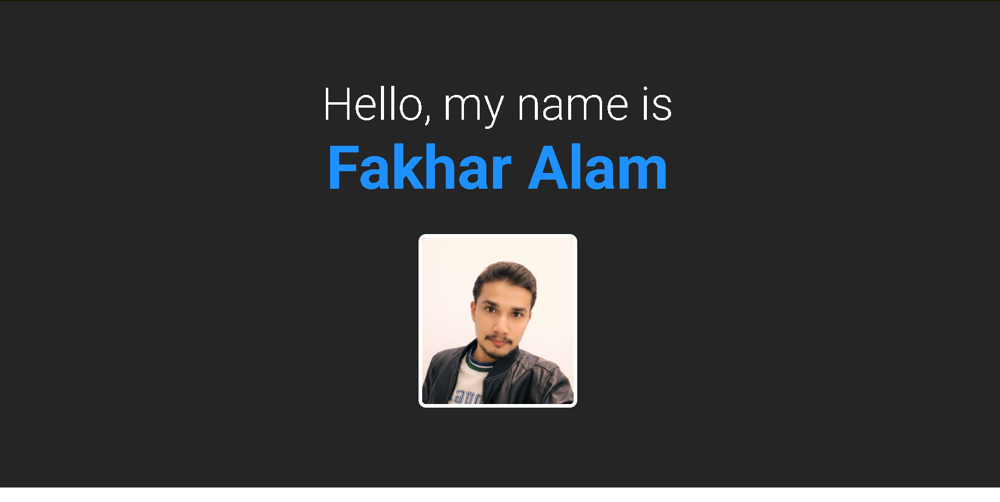
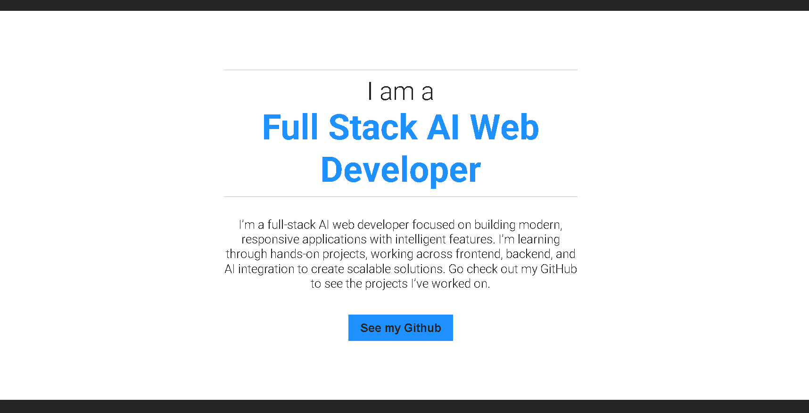
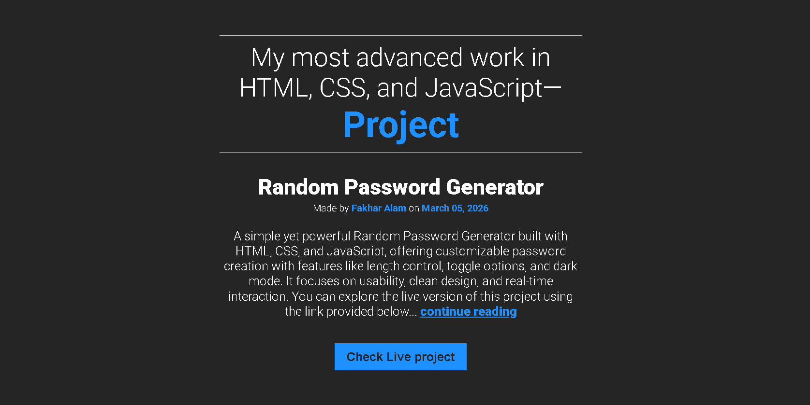

# 🌐 My Webpage

A personal webpage built using **HTML & CSS**, designed to showcase my journey as a **Full-Stack AI Web Developer** while practicing core CSS fundamentals.

---

## 📌 About This Project

This project serves as both a **personal branding webpage** and a **hands-on CSS practice project**.

It reflects my learning approach—building real projects, focusing on clean design, and gradually moving toward full-stack development with AI integration.

---

## 🚀 Features

* Clean and minimal UI
* Responsive centered layout
* Custom typography using Google Fonts
* Interactive hover effects (image & buttons)
* Structured sections for introduction and featured project
* Smooth transitions and simple animations

---

## 🛠️ Built With

* HTML5
* CSS3
* Google Fonts (Roboto)

---

## 📂 Project Structure

```bash
my-webpage/
│── index.html
│── style.css
│── img/
│   └── profile.png
│── Screenshots/
│   ├── screenshot 1.png
│   ├── screenshot 2.png
│   └── screenshot 3.png
│── README.md
```

---

## 📸 Screenshots

### 🧑‍💻 Hero Section



### 💡 About Section



### 🚀 Project Section



---

## 🌍 Live Project

🔗 [https://my-webpage-alam.netlify.app](https://my-webpage-alam.netlify.app)

---

## 🎯 Purpose

* Practice **CSS fundamentals**
* Build a **personal developer identity**
* Improve layout, spacing, and UI design
* Showcase my projects in a simple and clear way

---

## 🔗 Connect With Me

* GitHub: [https://github.com/ThisisAlam](https://github.com/ThisisAlam)
* LinkedIn: [https://www.linkedin.com/in/fakhar-e-alam-a046133b4/](https://www.linkedin.com/in/fakhar-e-alam-a046133b4/)
* Learn Full Stack Development: [https://scrimba.com/?via=u43a7734](https://scrimba.com/?via=u43a7734)

---

## 💡 Note

This project is part of my continuous journey in **Full-Stack AI Web Development**, where I focus on learning by building and improving through real-world projects.

---
